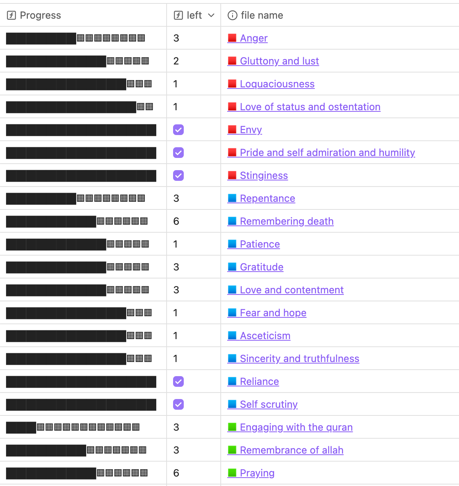

This project aims to focus on a certain type of excluded or unnoticed gap in religious knowledge that results in a lack of implementation of known practices. As a result, the project is divided into three parts/steps:

* The first step is understanding the science around goal setting, habit formation, and behavior change.
* The second step is getting a sense of all the practical implications of the abstract concepts we know of.
* The third step is showing you how you can begin taking action.

## The First Part - The Basics of the System

The system uses the **OKR method** for goal setting, which consists of three main components: **Objective**, **Key Results**, and **Initiatives**. Simply put, the key difference between traditional goal-setting and the OKR method is the introduction of key results—these are the measurable outcomes of the actions (referred to as initiatives) that are intended to achieve the objective. Each action acts as a hypothesis that may or may not achieve the objective, with its probability of success depending on how relevant the outcome (key result) is to the objective. This is important to remember, as it will come up again when we discuss the actions further down.

Now, let's focus on the **initiatives**. These are high-level actionable items that need to be carried out to achieve the objective, which is Janna. Each initiative includes documentation that links to multiple processes or habit files detailing the necessary actions. When all the processes related to an initiative are implemented, the initiative can be considered operational.

The **processes or habits** are implemented, changed, improved, or swapped using a specific framework explained further in [Process handling](docs/sidebar1/Resources/Process%20handling.md). Due to the interconnected nature of the objective and **Principle 3** (mentioned below), processes can be part of multiple initiatives simultaneously. Each process file includes a link to the relevant initiatives to facilitate navigation.

For a clearer understanding, here is an outline of the system:

```md
- Objective
	- Key Result 1
		- Initiative 1
			- Process 1
				- Process handling
			- Process 2
			- ...
		- Initiative 2
		- ...
	- Key Result 2
	- ...
```

The final, crucial part of the system is the **review process**. Any action that needs to be sustained long-term should be reviewed periodically. This ensures that the processes are being carried out effectively, that initiatives remain on track, and that key results are being met to achieve the ultimate goal.

## The Second Part - What To Do

### Contextualization of the OKR Method

Of course, the goal is to attain the highest level in paradise without any reckoning or punishment. According to the prophet, If this isn't the goal, it should be.

This goal is achieved through 3 key results and their respective initiatives: (some initiatives are grouped due to their similarity in theme)

* Outer actions - Worshiping Allah
	* [Praying](docs/sidebar1/Initiatives/worship/Praying.md)
	* [Zakat, charity, and selflessness](docs/sidebar1/Initiatives/worship/Zakat%20and%20charity%20and%20selflessness.md)
	* [Fasting](docs/sidebar1/Initiatives/worship/Fasting.md)
	* [Hajj](docs/sidebar1/Initiatives/worship/Hajj.md)
	* [Reciting the Quran](docs/sidebar1/Initiatives/worship/Reciting%20the%20quran.md)
	* [Remembrance of Allah](docs/sidebar1/Initiatives/worship/Remembrance%20of%20allah.md)
	* [Seeking the lawful](docs/sidebar1/Initiatives/worship/Seeking%20the%20lawful.md)
	* [Upholding the rights of Muslims](docs/sidebar1/Initiatives/worship/Upholding%20the%20right%20of%20muslims.md), [Managing the spouse](docs/sidebar1/Initiatives/worship/Managing%20spouse.md) and [Parenting](docs/sidebar1/Initiatives/worship/Parenting.md)
	* [Commanding good and forbidding evil](docs/sidebar1/Initiatives/worship/Commanding%20good%20and%20forbidding%20evil.md)
	* [Following the Sunnah](docs/sidebar1/Initiatives/worship/Following%20the%20sunnah.md)
* Inner actions - Purifying the heart from blameworthy character traits
	* [Gluttony and lust](docs/sidebar1/Initiatives/bad%20traits/Gluttony%20and%20lust.md)
	* [Loquaciousness](docs/sidebar1/Initiatives/bad%20traits/Loquaciousness.md)
	* [Anger](docs/sidebar1/Initiatives/bad%20traits/Anger.md)
	* [Envy](docs/sidebar1/Initiatives/bad%20traits/Envy.md)
	* [Stinginess](docs/sidebar1/Initiatives/bad%20traits/Stinginess.md)
	* [Love of status and ostentation](docs/sidebar1/Initiatives/bad%20traits/Love%20of%20status%20and%20ostentation.md)
	* [Pride, self-admiration, and humility](docs/sidebar1/Initiatives/bad%20traits/Pride%20and%20self%20admiration%20and%20humility.md)
* Inner actions - Developing praiseworthy character traits
	* [Repentance](docs/sidebar1/Initiatives/good%20traits/Repentance.md)
	* [Fear and hope](docs/sidebar1/Initiatives/good%20traits/Fear%20and%20hope.md)
	* [Asceticism](docs/sidebar1/Initiatives/good%20traits/Asceticism.md)
	* [Patience](docs/sidebar1/Initiatives/good%20traits/Patience.md)
	* [Gratitude](docs/sidebar1/Initiatives/good%20traits/Gratitude.md)
	* [Sincerity and truthfulness](docs/sidebar1/Initiatives/good%20traits/Sincerity%20and%20truthfulness.md)
	* [Reliance](docs/sidebar1/Initiatives/good%20traits/Reliance.md)
	* [Love](docs/sidebar1/Initiatives/good%20traits/Love.md)
	* [Contentment with divine decree](docs/sidebar1/Initiatives/good%20traits/Contentment%20with%20divine%20decree.md)
	* [Remembering death](docs/sidebar1/Initiatives/good%20traits/Remembering%20death.md)
	* [Self-scrutiny](docs/sidebar1/Initiatives/good%20traits/Self%20scrutiny.md)

> To make the initiatives more comprehensive, I merged the initiatives of the bad traits with their opposite good traits, as one represents the absence of the other.

### The Principles

The initiatives/processes follow a set of principles:

1. **Simple yet Comprehensive**: Designed to cater to all types of Muslims while retaining the key points needed to understand the nuances of each action. This benefits different audiences, including:
    * **New Muslims**: Providing an overview of essential practices.
    * **Practicing Muslims**: Helping perfect their current practices.
    * **Muslim Scholars**: Enhancing personal methodologies.
2. **Practical Knowledge Only**: Focused exclusively on actionable knowledge, excluding abstract or faith-building exercises (some books from the *Revival* were excluded because of this). While the project is not intended to be a da'wah, any positive da'wah effect is welcome. For those seeking theoretical knowledge to ground their faith, seek other resources.
3. **Built for Easy Review**: Merged similar concepts under unified processes to minimize their number. This ensures easier reviews and supports long-term maintenance.

You might encounter some actions in the initiative that don't have any process linked to them. This can be explained by one of three reasons:

* The action demands a project, not a process.
* The action has already been included in another process.
* The action is too simple or too vague to be included in a process that is due for monthly review.

### Sources and Inspirations

I didn't include the sources next to each action in the processes because of the complexity of the task; however, I tried to use trusted sources as much as possible. The project was heavily inspired by *The Revival of the Religious Sciences* by Imam Abu Hamid al-Ghazali and was scrutinized through other books and resources, such as:

* *Handbook to God* playlist by Yaqeen Institute and other Yaqeen content
* *The Way of the Muslim* by Abu Bakr Jabir al-Jaza'iri
* *Ranks of the Divine Seekers* by ibn Qayyim al-Jawziyya
* *A Handbook of Spiritual Medicine* by Ibn Daud
* *Reflecting on the Names of God* by Jinan Yousef
* …

## Third Part - Taking Action

### How to Use

1. You can use your own system by extracting the processes documented here.
2. Or you can use the tool endorsed by the author and the associated file by following [this tutorial](docs/sidebar1/Resources/Obsidian%20implementation.md). As a bonus, you'll get a dynamic visual representation of your performance and a gamification of the system to keep you motivated. You can see an example below:



### How to Contribute

You are encouraged to create a PR or, if not, an issue on GitHub. Only contact me directly if you wish to review the entirety of the project.

Always cite your reason for any change and the reference for said change. I will prioritize a scholar's opinion over a layperson's; the bigger the change, the more arguments you'll have to provide. I will address your request weekly or monthly, depending on my availability.

Otherwise, you can remember us in your dua, asking Allah to guide and support us in our efforts to make this project beneficial and successful for everyone involved (us included insha'Allah).

:::warning reminder about tawakkul

This is not a guaranteed way of attaining paradise; it is only our best effort to help as much as possible. Guidance and success remain in Allah's hands, subhanahu wa ta'ala.

:::
