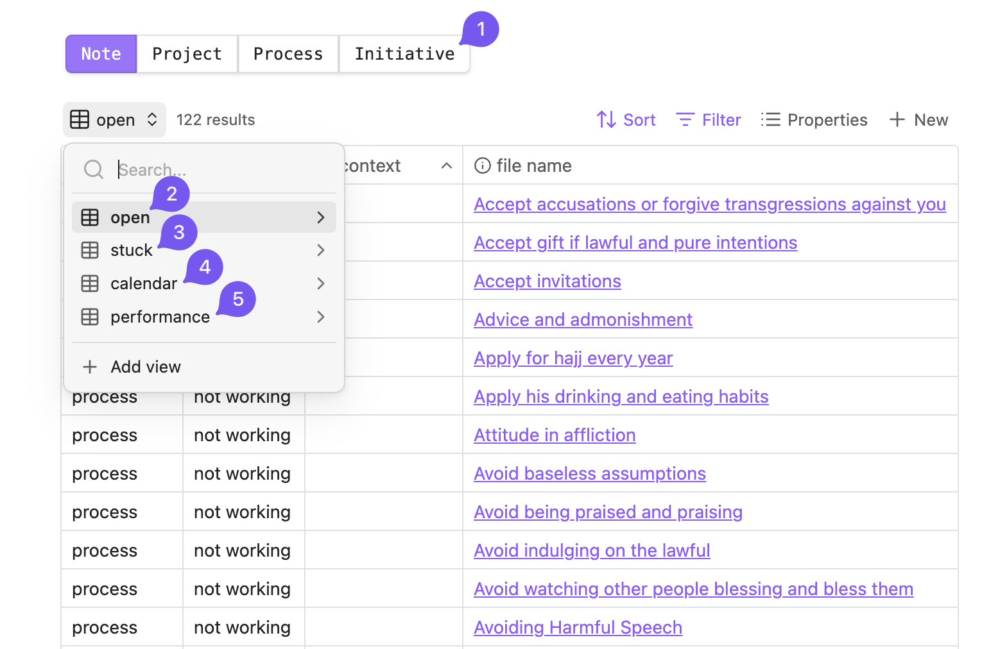

## How to Use the [Obsidian Vault](../../../assets/RTJ.zip)

:::info

This introductory section will help you understand how the vault is structured. For instructions on how to use it, refer to the "What you need to do" heading.

:::

### What is This App? and What is This Vault?

[**Obsidian**](https://obsidian.md/) is a versatile, offline, cross-platform note-taking software. You can use it to manage this specific goal or expand its use to manage all aspects of your life. Here, we'll focus only on using it to support the goal of this system.

A **vault** is a folder of text files in markdown format that can be opened with obsidian. It contains all the necessary components to begin implementing the system in your life. Download it from [here](../../../assets/RTJ.zip).

### File Types

First, you need to understand the key file type used in this vault to understand the following headings:

* **Project**: One-off task contributing to the domains in various ways (e.g., creating processes, changing the documentation of the domain, improving the system itself). When completed, they can be archived or deleted.
* **Processes**: Regular habits linked to specific domains (more on this in [Process Handling](docs/sidebar1/Resources/Process%20handling.md)).
* **Domains**: Contain relevant documentation and link to all the relevant processes.
* **Note**: Quick, unstructured captures (often for inbox items).

### The Homepage

1. **Buttons**: With them, you can create new files for each file type described above. Each file type has a specific template. When it comes to "processes" and "projects," you'll be prompted to choose their respective domain.
2. **Open**: This is a dynamic view that updates itself and contains these files:
	* The inbox items (notes you have captured but not yet organized);
	* The problem files with titles that may cause syncing issues;
	* Active unfinished projects;
	* Processes due today or overdue;
	* Non-working processes;
	* Not designed domains (this is useful if you're creating your own domain).
3. **Stuck**: This is a dynamic view that updates itself and contains projects, processes, and domains that are blocked or waiting, with start dates that are not yet due.
4. **Calendar**: This is a dynamic view that updates itself and shows an overview of your schedule. It contains:
	* Overdue projects and processes;
	* Projects scheduled between today and next month;
	* Processes due today.
5. **Performance**: see the “checking progress” section below for more details.

### Properties and Task Management

Each file type has properties to support task management and progress tracking. Here's a breakdown:

* `status`: The file can go through different states, such as `waiting` for an event to be ready, `blocking` another file from being ready, or `blocked` by another file. These states can also be specific to each file type:
	* Processes can be `working/not working`: Check this property to see if you are currently following the process as described in the process file.
	* Projects can be `done/not done`: Use this to archive completed projects. This removes the projects from view but keeps them in the corresponding folder.
	* Domain can be `designed/not designed`: Check this if it has solid documentation linking to all relevant processes. This is recommended only if you plan to restructure or create a new domain.
* `detail`: This property helps when reviewing processes. Set it to true if the process' documentation is lengthy, so you'll know when reviewing that you need to check more than just the title to determine its state.
* `context`: This property varies depending on the file type.
	* If it's a project, it should contain its location to help coordinate projects with similar locations.
	* If it's a working process, it should contain the time by which the process is completed. This helps avoid over-scheduling.
	* If it's a non-working process, it should include the step the user needs to take to make it operational again. Refer to [Process handling](docs/sidebar1/Resources/Process%20handling.md) under "intersection with obsidian" for more details.
* `dependency`: Use this property if the file depends on another file (i.e., you can only proceed with the task once the other action is completed). This helps identify bottlenecks and keep the system running smoothly.
* `start`: Use this when you cannot take action until a certain event occurs. If the event date is known, set the `start` date. If unknown, estimate the start date and set the status to `waiting`. When the estimated date arrives, check if the event has occurred. If it has, revert the status and proceed; if not, leave it in `waiting`, set a new estimated start date. Repeat this loop until an action can be taken.
* `due`: Use this property when a task has an absolute deadline that cannot be changed. It helps gauge the task's urgency.
* `duration`: Use this in conjunction with `due`. Enter the estimated number of days required to complete the project, ensuring it appears in time to meet the deadline.
* `recurrence`: Use this to repeat processes in Obsidian. You can write the recurrence in natural language (e.g., in one month or next week), and use the toolbar button "repeat" to postpone the due date based on the recurrence. For more details, see [Process handling](docs/sidebar1/Resources/Process%20handling.md) in the last paragraph of the "Prompt" section.

### Checking Progress

To gain an accurate view of your performance, [review the processes](docs/sidebar1/Processes/Review%20working%20processes.md) on a monthly basis. Make sure to check the full documentation of the processes that have the property `detail` checked, and set the status of the processes you are not applying to `not working`. Once the domains have been reviewed, you will be able to check the performance view, and based on each column, you can evaluate different aspects:

* First column: the progress of the domain's completion, which is the total number of processes excluding those that are "waiting," divided by the number of active processes.
* Second column: the number of processes needed to complete the domain.
* Third column: the number of completed domains within each "Objective."

### Updating the System

To stay updated with changes in the vault:

* **If You've Made Changes**: Check relevant changes from the "updates" section and add them manually. If you want to update automatically, fork the GitHub repository and use the folder `my-website/assets/RTJ` as a vault.
* **If You Still Haven't Made Changes**, Re-download the latest version of the vault.

### How Can I Use it on My Phone?

You can use [Syncthing](https://syncthing.net/) or [Resilio Sync](https://www.resilio.com/sync/) to sync your Obsidian vault with your phone. Just make sure not to rename the vault or to use any special characters in the file titles to avoid syncing problems. (The problematic file titles will appear on the homepage for you to deal with).

## What You Need to Do

### Step 1: [Download and familiarize yourself with the Vault](../../../assets/RTJ.zip)

* **Unzip** the vault and **open** the folder with obsidian.
* **Review the Documentation**: Read each domain's main points to understand its purpose and goals.
* **Agree on Actions**: Reflect on whether the listed actions and goals align with your approach. Adjust them if necessary.

### Step 2: Identify Active Processes

In the `open` view, set the status of the processes you are already applying to `working`. This marks these processes as part of your current routine.

### Step 3: Start Working on the New Processes

* **Use the [Process handling](docs/sidebar1/Resources/Process%20handling.md) framework**: Begin implementing the non-working processes based on the needed action.
* **Identify Necessary Modifications**: If a process needs to be adjusted to fit your situation, create a project to outline the required changes.

### Step 4: Manage Your Vault

* **Give Time to Each Section**: Regularly switch between projects and processes and balance working on both of them.
* **Maintain Organization**: Clear bottlenecks by addressing dependencies, processing inbox items, and dealing with problematic file names.

### Step 5: Review Regularly

* **Review on Schedule**: Review your processes periodically, monthly, or whenever you've completed the current non-working processes.
* **Postpone if Needed**: If a review is completed before the scheduled time, update the next review date accordingly.

### Step 6: Track Your Progress and Performance

* **Use Performance Metrics**: Check the performance sections, such as the level system or radar chart, to see your progress over time.
* **Identify Gaps**: Look for areas needing improvement and adjust to fill any identified gaps.

### Step 7: Repeat the Cycle

After tracking your performance, go back to Step 3 and repeat the process continuously to maintain progress.