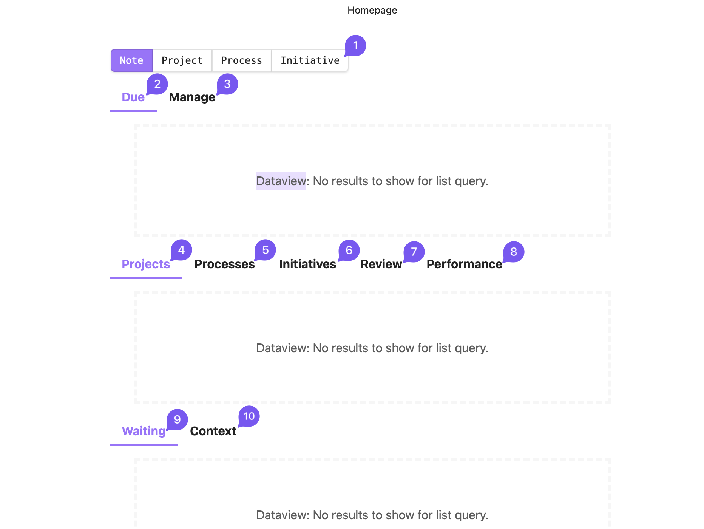

## How to Use the [Obsidian Vault](../../../assets/RTJ.zip)

> [!info]
> 
> 
> This introductory section will help you understand how the vault is structured. For instructions on how to use it, refer to the "What you need to do" heading.
> 

### What is This App? and What is This Vault?

[**Obsidian**](https://obsidian.md/) is a versatile, offline, cross-platform note-taking software. You can use it to manage this specific goal or expand its use to manage all aspects of your life. Here, we'll focus only on using it to support the goal of this system.

A **vault** is a folder of text files in markdown format that can be opened with obsidian. It contains all the necessary components to begin implementing the system in your life. Download it from [here](../../../assets/RTJ.zip).

### File Types

First, you need to understand the key file type used in this vault to understand the following headings:

* **Project**: One-off task contributing to the initiatives in various ways (e.g., creating processes, changing the documentation of the initiative, improving the system itself). When completed, they can archived or deleted.
* **Processes**: Regular habits linked to specific initiatives (more on this in [Process Handling](Resources/Process%20handling.md)).
* **Initiatives**: Contain relevant documentation and link to all the relevant processes
* **Note**: Quick, unstructured captures (often for inbox items).

### The Homepage

This is the homepage. It contains **Dynamic Queries** or views that bring out the files you need to look at depending on different contexts. Each section serves a unique purpose:

1. **Buttons**: With them, you can create new files for each file type described above. Each file type has its specific template. And when it comes to "processes" and "projects", you'll get a prompt to choose their corresponding initiative.
2. **Due**: All projects and processes that have deadlines that are due today or tomorrow (this period could be extended using the `duration` property)
3. **Manage**: it contains:
	* The inbox items (the notes you have captured but not yet organized)
	* The dependencies that are present in your vault
	* The problem files that have titles that will cause syncing problems
4. **Projects**: _Projects without Deadlines_: Displays active, unfinished projects that don't have due dates.
5. **Processes**: Lists non-working processes grouped by the step described in [Process handling](Resources/Process%20handling.md) under the heading "Intersection with Obsidian".
6. **Initiatives**: This shows initiatives that are not yet fully designed. This is useful if you're creating your own initiative; otherwise, it should stay empty.
7. **Review**: This section contains processes that need to be reviewed. When you open the note, you can use the toolbar button "reviewed" to postpone the review date to next month.
8. **Performance**: This section displays views that help you track progress (see below for more on performance tracking). It is discussed below under the heading "Checking your progress".
9. **Waiting**: This category includes projects, processes, and initiatives that are waiting and have start dates that are not yet due.
10. **Context**: This includes projects with contexts; read the associate property explanation to understand its use.

### Properties and Task Management

Each file type has properties to support task management and progress tracking. Here's a breakdown:

#### Properties Specific to File Types

* `working`: Check this property if you are currently following the process as described in the process file.
* `designed`: Check this property to see if the initiative has solid documentation linking to all relevant processes. This is only recommended if you intend to restructure or create a new initiative.
* `step`: Check [Process handling](Resources/Process%20handling.md) under the heading "intersection with obsidian" for more details on how to use it.
* `review`: The date you will need to review the current process.

#### Task Management Properties

* `dependency`: Use this property if the file is dependent on another file (i.e., you can only proceed with the task once the other action is completed first). This helps identify bottlenecks and keep the system running smoothly.
* `start` and `waiting`: Use these when you cannot take action until a certain event occurs. If the date of the event is known, set the `start` date. If the date is unknown, estimate the start date and check `waiting`. When the estimated date arrives, check if the event has occurred. If it has, uncheck `waiting` and proceed; if not, leave `waiting` checked, set a new estimated start date, and repeat until you can take action.
* `due`: Use this property when a task has a hard deadline (an externally imposed deadline that cannot be changed). This helps gauge the task's urgency.
* `duration`: Use this property in conjunction with `due`. Fill it with the number of days the project is estimated to take, ensuring it resurfaces in time to complete before the deadline.
* `completed`: Use this to archive completed projects. This removes the projects from view but keeps them in the corresponding folder.
* `file`: Use this when you need a specific file in the vault to complete an action. Alternatively, you can link to the file within the note.
* `context`: Use this to group projects by context (e.g., shopping, waiting, meeting someone) for easy access based on specific situations.
* `recurrence`: Use this to repeat processes managed within Obsidian. You can write the recurrence in natural language (e.g., in one month or next week), and you can use the toolbar button "repeat" to postpone the due date based on the recurrence. For more information on this type of process, refer to [Process handling](Resources/Process%20handling.md) in the last paragraph of the "Prompt" section.

### Checking Progress

To get an accurate view of your performance, first review the processes. The default review interval is once a month, but you can also review initiatives after completing all necessary modifications to the current non-working processes. Just be sure to update the review date accordingly.

Once the initiatives are reviewed according to these guidelines, you'll be able to assess your performance using two methods:

* **Level System**: A numeric level system that estimates the number of processes needed to reach your desired level.
* **Radar Chart**: This chart displays initiatives grouped by key results. The more rounded the chart, the better your performance across categories, helping you identify areas needing improvement.

> This performance section also serves a motivational purpose, incorporating gamification elements.

### Updating the System

To stay updated with changes in the vault:

* **If You've Made Changes**: Check the release notes and incorporate relevant updates.
* **If You Haven't Made Changes**, Re-download the latest version of the vault.

### How Can I Use it on My Phone?

You can use [Syncthing](https://syncthing.net/) to sync your Obsidian vault with your phone. Just make sure not to rename the vault or to use any special characters in the file titles to avoid syncing problems. (The problematic file titles will appear on the homepage for you to deal with).

## What You Need to Do

### Step 1: [Download and familiarize yourself with the Vault](../../../assets/RTJ.zip)

* **Unzip** the vault and **open** the folder with obsidian.
* **Review the Documentation**: Read each initiative's main points to understand its purpose and goals.
* **Agree on Actions**: Reflect on whether the listed actions and goals align with your approach. Adjust them if necessary.

### Step 2: Identify Active Processes

Check the `working` property for all processes you're already doing. This flags these processes as part of your current routine. You can use this [file](Resources/Bulk%20editing%20processes.md) to bulk edit processes.

### Step 3: Start Working on the New Processes

* **Use the Tiny Habits Model**: Begin implementing the non-working processes based on the needed action, following the framework described in [Process handling](Resources/Process%20handling.md).
* **Identify Necessary Modifications**: If a process needs to be adjusted to fit your situation, create a project to outline the required changes.

### Step 4: Manage Your Vault

* **Give Time to Each Section**: Regularly switch between projects and processes and balance working on both of them.
* **Maintain Organization**: Clear bottlenecks by addressing dependencies, processing inbox items, and dealing with problematic file names.

### Step 5: Review Regularly

* **Review on Schedule**: Review your processes periodically, monthly, or whenever you've completed the current non-working processes.
* **Postpone if Needed**: If a review is completed before the scheduled time, update the next review date accordingly.

### Step 6: Track Your Progress and Performance

* **Use Performance Metrics**: Check the performance sections, such as the level system or radar chart, to see your progress over time.
* **Identify Gaps**: Look for areas needing improvement and adjust to fill any identified gaps.

### Step 7: Repeat the Cycle

After tracking your performance, go back to Step 3 and repeat the process continuously to maintain progress.
